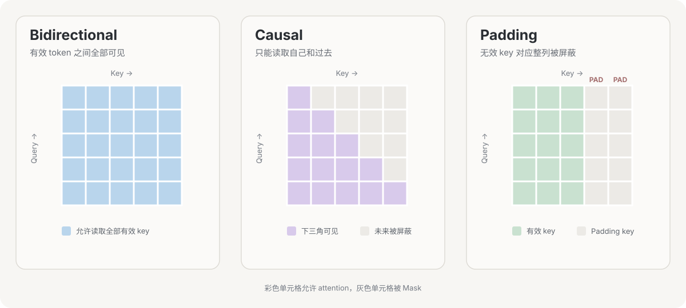
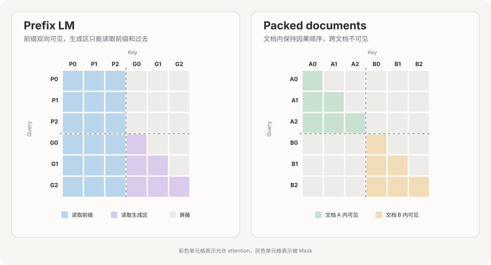
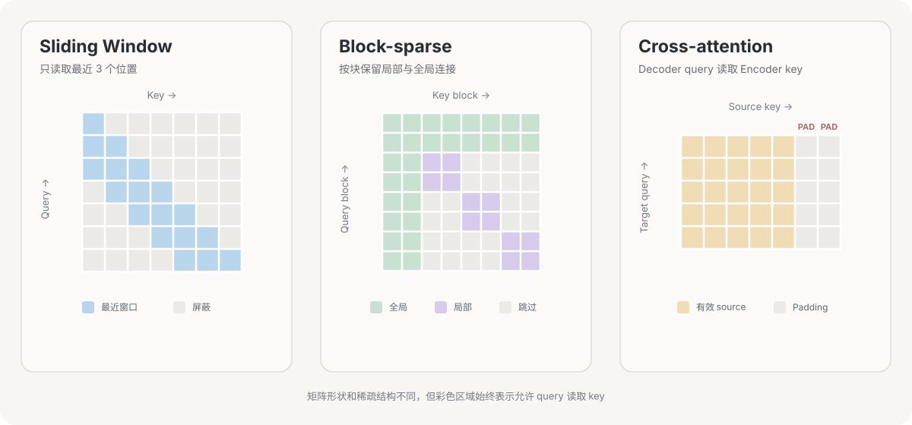
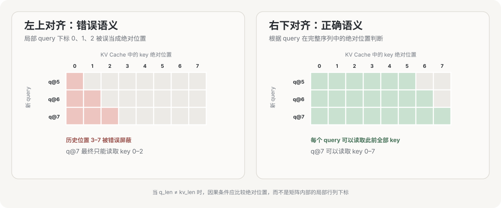

Attention Mask 决定一个 query 可以读取哪些 key。它不负责生成内容，也通常不是可学习参数；它只是把任务的约束写进 attention 矩阵。比如自回归模型不能偷看未来，批处理时不能读取 padding，文档打包后也不能跨样本互相读取。

先区分三个名字相近的东西：Attention Mask 控制 token 之间能否互相读取；BERT 式 MLM Mask 会把输入替换成 `[MASK]`，用于构造预测任务；Loss Mask 只决定哪些位置计入损失。把 prompt 对应的 label 设为 `-100`，并不会阻止后续 token 在 attention 中读取 prompt。

## Mask 在 Transformer 中的位置

对单个 attention head，缩放点积注意力可以写成

$$
\operatorname{Attention}(Q,K,V)
=
\operatorname{softmax}
\left(
\frac{QK^T}{\sqrt{d_k}}+M
\right)V
$$

$Q\in\mathbb{R}^{L_q\times d_k}$ 是 query，$K\in\mathbb{R}^{L_{kv}\times d_k}$ 和 $V\in\mathbb{R}^{L_{kv}\times d_v}$ 是 key、value；$L_q$ 与 $L_{kv}$ 分别是 query 和 key/value 的长度，$d_k$ 是每个 head 的 key 维度。$M\in\mathbb{R}^{L_q\times L_{kv}}$ 是 mask 对应的加性偏置。

因此，Mask 位于每一层 attention 内部：完成 Q、K 投影和点积以后，加在 attention score 上，再进入 softmax。它和位置编码不是同一个东西。位置编码告诉模型 token 之间的位置关系，Mask 直接规定某些连接能否出现。[原始 Transformer](https://arxiv.org/abs/1706.03762)中的 decoder self-attention 就是在 softmax 前屏蔽后续位置。

对于硬 Mask，通常定义

$$
M_{ij}=
\begin{cases}
0, & \text{query }i\text{ 可以读取 key }j \\
-\infty, & \text{禁止读取}
\end{cases}
$$

被禁止位置经过 softmax 后权重为零，因为 $e^{-\infty}=0$。有限的负数也可以降低某个位置的权重，但那更接近 attention bias，而不是严格禁止。

## 布尔 Mask、加性 Mask 与广播

程序中常见两种表示：

- 布尔 Mask 只记录“允许/禁止”，attention 内核再把禁止位置转换成 $-\infty$。
- 浮点 Mask 直接加到 score 上。硬屏蔽使用 $0$ 与 $-\infty$，相对位置 bias 等软约束也可以一起放进来。

不要凭经验猜 `True` 的含义。以 PyTorch 为例，`torch.nn.functional.scaled_dot_product_attention` 中 `True` 表示允许参与 attention；`nn.MultiheadAttention` 的 `key_padding_mask` 中 `True` 却表示需要屏蔽。两个接口正好相反，官方文档也专门标出了这一点。[PyTorch SDPA 文档](https://docs.pytorch.org/docs/stable/generated/torch.nn.functional.scaled_dot_product_attention)

多头 attention 的 score 通常是 `[B, H, Lq, Lkv]`。Mask 只要能广播到这个形状即可：

| Mask 形状 | 常见用途 |
| --- | --- |
| `[Lq, Lkv]` | 整个 batch、所有 head 共用同一结构 |
| `[B, 1, 1, Lkv]` | 每个样本各自的 key padding mask |
| `[B, 1, Lq, Lkv]` | 每个样本各自的因果、分段或文档 Mask |
| `[B, H, Lq, Lkv]` | 不同 head 使用不同连接结构或 bias |

结构 Mask 可以共享，但每一层都要在自己的 attention 计算中执行它。若模型采用稀疏 attention，不同层也可以使用不同窗口或不同稀疏模式。

### 全行被屏蔽为什么会产生 NaN

如果某一行全部是 $-\infty$，softmax 需要计算

$$
\frac{e^{-\infty}}{\sum_j e^{-\infty}}
=\frac{0}{0}
$$

结果没有定义，朴素实现通常会得到 NaN。左侧 padding 与 causal mask 叠加时尤其容易出现这种行；PyTorch 的 SDPA 也曾记录过对应问题。[PyTorch issue #103749](https://github.com/pytorch/pytorch/issues/103749)

稳妥的做法是保证每个有效 query 至少能看到一个 key，并单独忽略或清零 padding query 的输出。把 $-\infty$ 换成 `torch.finfo(dtype).min` 虽然可能避开 NaN，但全行数值相同时 softmax 会变成均匀分布，仍会读取 value，因此不能把它当成通用修复。

## 常见 Mask 类型

### Bidirectional：双向可见

Encoder-only 模型通常允许每个有效 token 读取左右两侧所有有效 token。此时没有方向性 Mask，只需处理 padding：

$$
A_{ij}=\operatorname{valid}(j)
$$

$A_{ij}$ 是布尔可见性，`valid(j)` 表示第 $j$ 个 key 不是 padding。注意它主要屏蔽 score 的列；padding query 对应的行往往还要在后续层或 loss 中忽略。

### Causal：只能读取过去

Decoder-only 模型使用下三角可见性：

$$
A_{ij}=[j\le i]
$$

方括号表示条件成立时为 1，否则为 0。训练时整段 token 可以并行输入，但第 $i$ 个位置只能读取自己和此前位置，因此不会泄漏未来答案。这就是 GPT 类模型能并行训练、又保持自回归语义的原因。

### Padding：忽略补齐位置

同一个 batch 中序列长度不同，通常会补齐到统一长度。Padding Mask 让所有 query 都看不到无效 key：

$$
A_{b,i,j}=\operatorname{valid}(b,j)
$$

$b$ 是 batch 下标。它经常和 causal mask 取交集：

$$
A_{b,i,j}=[j\le i]\land \operatorname{valid}(b,j)
$$



三张图使用同一坐标：横轴是 key，纵轴是 query。双向 attention 保留全部连接；causal mask 只保留下三角；padding mask 屏蔽无效 key 对应的整列。它不会自动删除 padding query 的行，因此训练时仍要用 loss mask 忽略这些位置。

### Prefix LM 与 segment/document Mask

Prefix LM 把序列分成前缀和生成区。长度为 $p$ 的前缀内部双向可见；生成区可以读取完整前缀和此前生成内容：

$$
A_{ij}=[j<p]\ \lor\ [i\ge p\land j\le i]
$$

这种设计让同一个 Transformer 同时承担“理解前缀”和“自回归生成”。UniLM 就通过不同 self-attention mask，在共享网络中实现双向、单向和 sequence-to-sequence 语言建模。[UniLM 论文](https://arxiv.org/abs/1905.03197)

Segment Mask 常用于 sequence packing：多个短样本拼成一个长序列以减少 padding，但不同样本之间不能互相读取。若 `seg(i)` 是 token 所属样本，decoder 的可见性为

$$
A_{ij}=[\operatorname{seg}(i)=\operatorname{seg}(j)]\land[j\le i]
$$



图中横轴是 key，纵轴是 query，彩色方格表示允许读取。左图的 P0–P2 是前缀：它们彼此双向可见；G0–G2 是生成区，只能读取完整前缀和已经出现的生成 token。右图把文档 A、B 拼进同一序列，两个文档各自保留因果下三角，跨文档区域全部被屏蔽。

这两种 Mask 也加在 $QK^T/\sqrt{d_k}$ 之后、softmax 之前。先用布尔条件生成可见性矩阵 $A$，再转换成加性 Mask：

$$
M_{ij}=
\begin{cases}
0,&A_{ij}=1\\
-\infty,&A_{ij}=0
\end{cases}
$$

下面的 PyTorch 代码给出完整过程。`q`、`k`、`v` 的形状是 `[B, H, L, D]`，`allowed` 是 `[B, L, L]`，其中 `True` 表示允许读取：

```python
import math

import torch
import torch.nn.functional as F


def eager_attention(q, k, v, allowed):
    scores = q @ k.transpose(-2, -1)
    scores = scores / math.sqrt(q.shape[-1])

    # [B, L, L] -> [B, 1, L, L]，广播到所有 attention head
    scores = scores.masked_fill(~allowed[:, None], float("-inf"))
    weights = torch.softmax(scores, dim=-1)
    return weights @ v


def build_prefix_lm_mask(prefix_lens, seq_len):
    # prefix_lens: [B]，每个样本的前缀长度可以不同
    device = prefix_lens.device
    q_pos = torch.arange(seq_len, device=device).view(1, seq_len, 1)
    k_pos = torch.arange(seq_len, device=device).view(1, 1, seq_len)
    prefix = prefix_lens.view(-1, 1, 1)

    read_prefix = k_pos < prefix
    read_generated_history = (q_pos >= prefix) & (k_pos <= q_pos)
    return read_prefix | read_generated_history


def build_packed_document_mask(segment_ids):
    # segment_ids: [B, L]，例如 [0, 0, 0, 1, 1, 1]
    seq_len = segment_ids.shape[-1]
    pos = torch.arange(seq_len, device=segment_ids.device)
    causal = pos.view(1, 1, seq_len) <= pos.view(1, seq_len, 1)
    same_document = segment_ids[:, :, None] == segment_ids[:, None, :]
    return same_document & causal
```

如果直接使用 `scaled_dot_product_attention`，不需要手动创建加性矩阵。PyTorch SDPA 会在内部把布尔 Mask 应用到 score 上：

```python
allowed = build_prefix_lm_mask(prefix_lens, q.shape[-2])
# Packed document 时改用：
# allowed = build_packed_document_mask(segment_ids)

output = F.scaled_dot_product_attention(
    q,
    k,
    v,
    attn_mask=allowed[:, None],  # SDPA 中 True 表示允许读取
    dropout_p=0.0,
)
```

这里不要再传 `is_causal=True`，因为 Prefix LM 或 document mask 已经包含了自己的因果规则。上面的 packed document 示例假设序列中没有 padding；若同时存在 padding，应再与 key padding mask 取交集，并保证有效 query 不会出现整行屏蔽。

前缀、文档边界、因果和 padding 并不是互斥类型，它们常通过逻辑与、逻辑或组合成最终 Mask。

### Local / Sliding Window：只看邻域

双向局部 attention 可以写成 $|i-j|\le w$；自回归滑动窗口则是

$$
A_{ij}=[i-w<j\le i]
$$

$w$ 是窗口长度。单层计算从全连接的 $O(L^2)$ 降到 $O(Lw)$，多层堆叠后信息仍能逐层传播到更远位置。Longformer 在局部窗口之外加入少量全局 token，让它们与整段序列相连。[Longformer 论文](https://arxiv.org/abs/2004.05150)

### Block-sparse：按块保留连接

逐元素 Mask 很灵活，却不一定适合 GPU。Block-sparse attention 把 score 切成矩形块，只计算被保留的块。BigBird 使用局部窗口、少量全局 token 和随机连接的组合，在长序列上把连接数降为线性量级。[BigBird 论文](https://arxiv.org/abs/2007.14062)

这里有一个实现上的条件：如果先完整计算 $QK^T$，再给大部分位置加 $-\infty$，显存和计算仍然接近 $O(L^2)$。只有内核真的跳过空块，稀疏 Mask 才能带来计算收益。

### Cross-attention：目标读取源序列

Encoder-decoder Transformer 的 cross-attention 中，query 来自 decoder，key/value 来自 encoder，所以 score 形状是 `[B, H, L_target, L_source]`。通常只需要屏蔽 source padding，每个 decoder query 都可以读取完整的 encoder 输出；防止偷看未来的 causal mask 应用于 decoder self-attention，而不是普通 cross-attention。[原始 Transformer 架构](https://arxiv.org/abs/1706.03762)



左图只保留当前 token 附近的历史窗口；中图按块保留局部连接和少量全局连接；右图是矩形 cross-attention，decoder query 可以读取有效的 encoder key，但不能读取 source padding。

## KV Cache 下不能直接画普通下三角

训练时通常有 $L_q=L_{kv}$，下三角矩阵不会产生歧义。增量解码使用 KV Cache 后，query 可能只有一个新 token，而 key/value 包含全部历史，因而 $L_q\ne L_{kv}$。

设 cache 中已有 $P$ 个 token，新 query 块内第 $i$ 个 token 的绝对位置为 $P+i$，那么 causal 条件应为

$$
A_{ij}=[j\le P+i]
$$

若再加滑动窗口，则为

$$
A_{ij}=[P+i-w<j\le P+i]
$$

判断依据是 query 与 key 的绝对位置，不能直接拿局部下标比较 $j\le i$。例如 `q_len=1, kv_len=100` 时，这个 query 应能读取 100 个已缓存位置，而不是只能读取第一个 key。



图中的三个 query 对应 KV 序列末尾的位置。普通左上角下三角仍从局部下标零开始，会错误地遮住大部分历史；右下对齐后，每一行才与 query 的绝对位置一致。

PyTorch 的 `is_causal=True` 在非方阵时使用左上对齐的三角 Mask；当 query 表示 KV 序列末尾的新 token 时，需要显式使用位置偏移或右下对齐的 causal bias。PyTorch 为两种语义分别提供了 [`causal_upper_left`](https://docs.pytorch.org/docs/stable/generated/torch.nn.attention.bias.causal_upper_left.html) 和 [`causal_lower_right`](https://docs.pytorch.org/docs/stable/generated/torch.nn.attention.bias.causal_lower_right.html)。这是手写 KV Cache 时最常见的错位来源之一。

不同后端对同名参数也未必采用相同对齐方式。例如 FlashAttention 从 2.1 起把非方阵 `causal=True` 改为右下对齐，因此切换内核时不能只看参数名，要检查版本对应的定义。[FlashAttention 官方变更说明](https://github.com/Dao-AILab/flash-attention#21-change-behavior-of-causal-flag)

## 设计一个 Mask 时先回答什么

一个可维护的实现，最好先把 Mask 写成关于 `(batch, head, q_pos, kv_pos)` 的可见性函数，再考虑张量形状和内核：

1. 哪些信息在任务上允许被读取？是否存在未来信息、样本边界或特殊全局 token？
2. query 与 key/value 是否同源、等长？位置应使用局部下标还是 cache 中的绝对位置？
3. 稀疏结构只是语义限制，还是希望内核真的少算？后者需要窗口或块结构能被底层实现识别。
4. 每个有效 query 是否至少保留一个 key？布尔语义、dtype、广播维度是否和调用的 API 一致？

先确定可见性，再选择布尔或加性表示。把 padding、causal、document 和 local 条件分别构造后组合，也比直接维护一个难以检查的四维张量更可靠。

## 2023—2026：Mask 语义和计算内核在分别演进

近年的变化可以分成两条线。第一条重新设计“看哪里”，第二条研究“怎样把同一个结果算得更快”。两者会配合使用，但不是同一概念。

### 语义与架构：局部、全局和动态选择

2023 年的 Mistral 7B 把 causal sliding-window attention 用进 decoder-only LLM，每层只读取最近的 KV，并用 rolling buffer 限制 cache 大小。[Mistral 7B 论文](https://arxiv.org/abs/2310.06825)

同年的 StreamingLLM 发现，只保留最近窗口会破坏已有模型的质量，而额外保留开头少量“attention sink”token 的 KV 可以恢复稳定的流式生成。它更准确地说是一种 KV 保留与可见性策略，并没有把原模型重新训练成新的局部 attention 架构。[StreamingLLM 论文](https://arxiv.org/abs/2309.17453)

局部 attention 也不必覆盖所有层。Gemma 2 在局部和全局 attention 层之间交替；Gemma 3 进一步采用 5 个 1024-token 局部层配 1 个全局层的重复结构，以降低长上下文 KV Cache 和 attention 成本。[Gemma 2 技术报告](https://arxiv.org/abs/2408.00118)、[Google 对 Gemma 3 架构的说明](https://developers.googleblog.com/gemma-explained-whats-new-in-gemma-3/)

2025 年的 Native Sparse Attention 又向前走了一步：稀疏连接不再只由固定窗口规定，而是组合压缩表示、细粒度动态选择和局部窗口。[NSA 论文](https://arxiv.org/abs/2502.11089) 同期的 MoBA 借鉴 MoE 路由，让 query 自己选择需要读取的 KV block，并能在 sparse 与 full attention 之间切换。[MoBA 论文](https://arxiv.org/abs/2502.13189) 这类方法从训练阶段学习怎样选择远处信息，属于 attention 架构，而不是单纯的 kernel 替换。

### 实现与内核：不物化稠密 Mask

[FlashAttention](https://arxiv.org/abs/2205.14135)通过分块与在线 softmax 减少 GPU HBM 和片上 SRAM 之间的数据搬运。对普通 dense attention，它计算的仍是精确结果，也没有把模型改成局部或稀疏 attention；所以 FlashAttention 不是 Mask 类型。

2024 年进入 PyTorch 的 FlexAttention 允许开发者用 `mask_mod(b, h, q_idx, kv_idx)` 描述 causal、sliding window、Prefix LM 或 document mask，再由编译器生成融合内核；`BlockMask` 还能让内核跳过完全为空的块。[PyTorch FlexAttention 文档](https://docs.pytorch.org/docs/main/nn.attention.flex_attention.html)

同一时期的 FlashMask 用列式稀疏结构压缩复杂 Mask，避免保存 $O(L^2)$ 的 dense mask，并让内核利用其中的空区域。[FlashMask 论文](https://arxiv.org/abs/2410.01359) 到 2026 年，PyTorch 又把 FlexAttention 的 `score_mod`、`mask_mod` 和 block sparsity 接入 FlashAttention-4 后端。[PyTorch 官方说明](https://pytorch.org/blog/flexattention-flashattention-4-fast-and-flexible/)

这条实现路线解决的是表达与执行成本：同一种 Mask 语义可以交给不同 kernel；同一个 FlashAttention kernel 也可以执行不同 Mask。讨论模型能力时看可见性规则，讨论速度和显存时再看 Mask 的存储格式、稀疏粒度和 kernel 支持。

## 小结

Attention Mask 本质上是一张有方向的可见性图：行是 query，列是 key。causal、padding、Prefix LM、文档边界和滑动窗口只是不同的连边规则。实现时最需要留意三件事：API 中布尔值的语义、广播后的真实形状，以及 KV Cache 导致的 query/key 位置错位。至于 FlashAttention、FlexAttention 和 FlashMask，它们回答的是这些规则如何高效执行。
